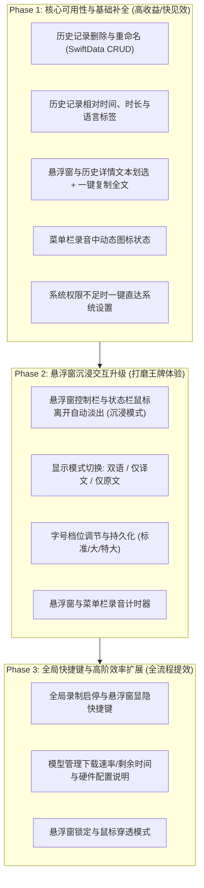

# OmniVoice — UI & 交互体验优化提案

本文件汇总并沉淀了 OmniVoice（当前版本 0.1.1）在真实会议、讲座、跨语言交流场景下的 UI 与人机交互全景体检、核心体验优化设计方案以及分期演进路线。

---

## 1. 背景与现状

OmniVoice 当前已建立起扎实稳定的底层架构：
- 混合双引擎解耦（系统级原生框架 `SpeechAnalyzer` / `Translation` 与端侧离线模型 R2T2 / T3PO）；
- 数据驱动的模型管理与增量分发（`ModelDownloadManager` + 独立模型管理窗口）；
- 独立的悬浮字幕窗（非激活窗口、抗干扰、位置大小持久化、平滑自动滚屏、透明度双维度调节）；
- 本地历史记录与 Markdown 导出（SwiftData）。

但作为一个日常高频常驻的生产力工具，从**“技术可行性验证”**走向**“真实用户日常爱用”**，目前在交互细节、视觉沉浸感以及信息流转上还存在若干明显的操作摩擦与体验断点。

---

## 2. 现状体检与核心痛点

| 模块 | 现有实现 | 核心痛点与体验断点 |
| :--- | :--- | :--- |
| **悬浮字幕窗**<br>([`FloatingTranscriptView`](file:///Users/hd/orca/workspaces/OmniVoice/new-model/Sources/OmniVoice/FloatingPanel/FloatingTranscriptView.swift#L14)) | 顶层常驻控制栏（启停、语种选择、关闭）+ 滚动字幕 + 底层状态栏；字号写死（14pt/13pt）；双语固定同屏渲染 | 1. **抢戏与遮挡**：开会或看 PPT 演讲时，顶层控制条与底栏常驻浪费面积，缺乏“纯字幕/沉浸模式”；<br>2. **文本不可交互**：字幕无法划选复制，会中他人提及的关键术语无法实时拷贝；<br>3. **显示模式单一**：听外语讲座只需看译文，目前无法隐藏原文；字号不可随屏幕分辨率（如 4K 外接屏 vs 13寸笔记本）调整；<br>4. **缺乏录制计时**：无法获知当前会话已持续多长时间。 |
| **菜单栏**<br>([`MenuBarContentView`](file:///Users/hd/orca/workspaces/OmniVoice/new-model/Sources/OmniVoice/Views/MenuBarContentView.swift#L9)) | 静态波形图标；下拉包含启停、设备选择、各窗口入口 | 1. **状态感知弱**：录音时图标仍是静态波形，悬浮窗隐藏时无法直观感知是否正在收音；<br>2. **唤起成本高**：无全局快捷键，每次启停或呼出必须移动鼠标精准点击菜单栏。 |
| **历史记录**<br>([`SessionListView`](file:///Users/hd/orca/workspaces/OmniVoice/new-model/Sources/OmniVoice/Views/SessionListView.swift#L7) / [`SessionDetailView`](file:///Users/hd/orca/workspaces/OmniVoice/new-model/Sources/OmniVoice/Views/SessionDetailView.swift#L6)) | 左侧列表仅显示默认标题与条目数；右侧为静态文本与 Markdown 文件导出 | 1. **管理能力缺失**：无法删除无用/测试会话，无法重命名会话标题；<br>2. **元数据贫乏**：缺少会话日期（如“今天 14:30”）、录音时长、语言对标签；<br>3. **分享流转链条长**：仅支持导出 `.txt/.md` 到本地磁盘，缺少“一键复制全文/仅译文”到剪贴板；单句缺少时间戳（如 `[02:15]`）。 |
| **模型管理**<br>([`ModelManagementView`](file:///Users/hd/orca/workspaces/OmniVoice/new-model/Sources/OmniVoice/Views/ModelManagementView.swift#L11)) | 列表展示各模型变体、体积与下载/删除操作 | 1. **认知负担重**：未说明系统引擎与大模型的实际优劣对比，缺少硬件配置门槛提示（如 T3PO 约 9.8GB 对 8GB 内存设备的冲击）；<br>2. **下载反馈有限**：仅有百分比，缺少下载速度（MB/s）、已下载/总大小及预估剩余时间。 |
| **权限与设置**<br>([`SettingsView`](file:///Users/hd/orca/workspaces/OmniVoice/new-model/Sources/OmniVoice/Views/SettingsView.swift#L19)) | 引擎选择、透明度调整滑块 | 1. 系统权限（麦克风/屏幕录制）缺失时仅在状态栏文字说明，未提供直达系统设置授权页的跳转按钮（Deeplink）。 |

---

## 3. 详细优化方案设计

### 3.1 悬浮字幕窗：从“工作面板”走向“智能沉浸字幕”

悬浮窗是用户在开会或看讲座时注视时间最长的界面，应遵循**“需要时触手可及，平时极度克制不抢戏”**的原则。

```
┌─────────────────────────────────────────────────────────────────┐
│ [● 00:14:23]  英语 ➔ 中文    [字号 A/A+]  [仅译文 ▾]  [锁定] [✕]  │ ◄── 鼠标悬停显示，移出自动淡出
├─────────────────────────────────────────────────────────────────┤
│ The next quarter's revenue projection has increased by 15%.     │
│ 下季度的营收预期增长了 15%。                         [ 复制 ]    │ ◄── 支持文本划选与悬停快速复制
│                                                                 │
│ Let's take a look at the key drivers behind this growth.        │
│ 让我们看一下这一增长背后的关键驱动因素。                          │
├─────────────────────────────────────────────────────────────────┤
│ 🎙 ●●●○○ 系统音频+麦克风                          [模型已就绪]    │ ◄── 录音中微型音量跳动
└─────────────────────────────────────────────────────────────────┘
```

#### A. 沉浸字幕模式与自动隐藏（Auto-hide Controls）
- **交互逻辑**：当鼠标移出悬浮窗 2 秒后，顶部控制栏与底部状态栏平滑淡出，仅保留半透明背景上的字幕内容；鼠标再次移入窗口时瞬间浮现。
- **效果**：在观看全屏幻灯片、视频或会议共享屏幕时，不会被控件按钮分散注意力，字幕体验接近电影/讲座字幕。

#### B. 显示模式切换（Display Modes）
- 在控制栏提供显式切换：
  1. **双语对照**（默认）：原文在上、译文在下（适合双语沟通与核对）；
  2. **仅译文**：只显示翻译文本（适合听完全听不懂的外语演讲/网课，节省 50% 竖向空间）；
  3. **仅原文**：只显示听写文本（适合同语种字幕辅助、听障辅助或同语种会议速记）。

#### C. 字号档位动态调节（Font Scaling）
- 提供预设字号档位（标准 14pt、大 18pt、特大 22pt），或快捷键 `Cmd + / Cmd -`；
- 在外接 4K 大屏远距离观看、或在小屏笔记本上紧凑排版时均能获得极佳阅读舒适度，配置持久化到 `UserDefaults`。

#### D. 行内文本划选与快捷复制
- 开启 `.textSelection(.enabled)`，允许鼠标双击取词或划选长句；
- 单条字幕块（Utterance）右侧提供悬停触发的微型「复制」图标，点击后直接复制该句原文与译文，大幅减少会议中摘抄他人发言的阻力。

#### E. 录制时长指示器（Elapsed Timer）
- 在控制栏（及菜单栏）增加 `00:12:45` 计时器，录制开始时走字，停止时复位，让用户对当前议程耗时心中有数。

#### F. 位置锁定与穿透模式（Window Lock & Click-Through）
- **锁定**：防止在密集多窗口操作中误拖拽悬浮窗；
- **鼠标穿透（可选）**：通过 `ignoresMouseEvents = true`，使悬浮窗处于纯显示状态，即使覆盖在网页播放器控制条或翻页按钮上方也不会阻挡点击。

---

### 3.2 菜单栏与全局快捷键：无感唤起与状态感知

作为无 Dock 图标的常驻辅助软件，菜单栏与快捷键是全局调用的第一生命线。

- **录制状态动态反馈**：
  - 录音中：[`MenuBarLabel`](file:///Users/hd/orca/workspaces/OmniVoice/new-model/Sources/OmniVoice/Views/MenuBarContentView.swift#L149) 替换为带脉冲呼吸效果的红色录音标（如 `record.circle.fill`）或随输入音量动态波动的音符跳动；
  - 解决痛点：悬浮窗隐藏在后台时，用户能随时从菜单栏确认麦克风是否依然处于收音监听状态。
- **菜单栏摘要面板**：
  - 下拉菜单首项展示动态状态卡片：`● 录音中 · 00:15:42 · 英语 ➔ 中文`；
  - 提供即时静音（Mute）或快速清屏入口。
- **全局快捷键（Global Hotkeys）**：
  - 引入全局快捷键监听：
    - **启停录音**（建议默认 `Cmd + Shift + R` 或可自定义）；
    - **唤起 / 隐藏悬浮窗**（建议默认 `Cmd + Shift + V`）。
  - 用户正在其他软件输入或演讲时，无需移动鼠标寻找菜单栏图标即可瞬间触发。

---

### 3.3 历史记录：从“文本日志”升级为“结构化会议资产”

#### A. 会话列表项信息丰富度
- 列表单元格改造为卡片样式：
  - **主标题**（支持双击编辑自定义名称）；
  - **时间标签**：智能相对时间（如“今天 14:30”、“昨天 09:15”、“9月20日”）；
  - **标签行**：录制总时长（如 `38 分钟`）、语种流向（如 `EN ➔ ZH`）、记录句数（如 `128 句`）。

#### B. 会话管理基础能力（CRUD）
- **删除会话**：
  - 支持右键菜单「删除会话…」、列表行滑动删除以及按 `Delete` 键触发；
  - 级联清理对应的 SwiftData `UtteranceRecord`，避免无用测试记录堆积。
- **重命名会话**：
  - 允许修改默认的时间戳标题为具体的会议主题（如“Q3产品规划讨论会”）。

#### C. 便捷流转与时间戳标记
- 在 [`SessionDetailView`](file:///Users/hd/orca/workspaces/OmniVoice/new-model/Sources/OmniVoice/Views/SessionDetailView.swift#L6) 顶部工具栏增加高频操作：
  - **「复制全文」**（格式化写入剪贴板，支持双语或单语言）；
  - **「仅复制译文」**；
  - 原有的「导出…」保留为文件归档用途。
- 文本行前标记相对开始时间的微型时间戳（如 `[04:20]`），便于回溯录音进度或对应录像。

---

### 3.4 模型管理与系统权限：降低认知负担与排障摩擦

#### A. 贴合用户的模型指引与硬件门槛提示
- 在 [`ModelManagementView`](file:///Users/hd/orca/workspaces/OmniVoice/new-model/Sources/OmniVoice/Views/ModelManagementView.swift#L11) 的各模型卡片中加入清晰直观的特性说明：
  - **Apple 系统内置引擎**：`开箱即用 · 零额外磁盘占用 · 极低内存负荷`（日常会议首选）；
  - **R2T2 (Q8_0)**：`端到端本地识别 · 高抗噪 · 约 2.4 GB 磁盘`；
  - **T3PO (Q5_K_M)**：`大模型深度翻译 · 语境自然流畅 · 约 9.8 GB 磁盘`（⚠️ 建议具备 **16GB 及以上统一内存**的 Mac 选用）。
- 消除普通用户对“该下哪一个”、“为什么这么大”的疑惑与误用。

#### B. 细化下载进度与存储管理
- 下载进度增加速率与体积反馈：`下载中 45% (4.4 GB / 9.8 GB) · 12.8 MB/s · 剩余约 6 分钟`；
- 底部增加“已下载模型总占用空间：X.X GB”与“在访达中显示模型缓存”按钮。

#### C. 权限缺失一键直达（Permission Deeplink）
- 当麦克风被拒或勾选“包含系统声音”缺少屏幕录制权限时，状态栏与提示框直接提供一键跳转按钮：
  - 麦克风权限：`x-apple.systempreferences:com.apple.preference.security?Privacy_Microphone`；
  - 屏幕录制权限：`x-apple.systempreferences:com.apple.preference.security?Privacy_ScreenCapture`；
  - 用户点击直接打开对应系统设置面板，极大缩短排障路径。

---

## 4. 实施演进路线（Roadmap）

建议按“投入产出比”与“用户痛点迫切度”分三期落地：



---

## 5. 架构与技术实现备忘

1. **悬浮窗非激活状态下的交互与动画**：
   - [`FloatingTranscriptPanel`](file:///Users/hd/orca/workspaces/OmniVoice/new-model/Sources/OmniVoice/FloatingPanel/FloatingTranscriptPanel.swift#L21) 的 `canBecomeKey = false` 确保不抢夺用户当前应用的焦点；
   - 自动隐藏控制栏可通过 SwiftUI 的 `.onHover` 结合带防抖的 `Task.sleep` 驱动 `@State private var isHovering = false`，通过 `.opacity()` 与 `.animation(.easeInOut)` 平滑切换；
   - 文本选择使用 `.textSelection(.enabled)`，在非激活窗口中依然可被鼠标框选与拷贝。
2. **历史记录数据安全与级联清理**：
   - [`RecordingSessionRecord`](file:///Users/hd/orca/workspaces/OmniVoice/new-model/Sources/OmniVoiceCore/Persistence/RecordingSessionRecord.swift#L8) 已配置 `@Relationship(deleteRule: .cascade, inverse: \UtteranceRecord.session)`，通过 `modelContext.delete(session)` 即可安全级联删除关联的数十条 Utterances。
3. **菜单栏与悬浮窗状态同步**：
   - 录音计时器可由 [`RecordingSession`](file:///Users/hd/orca/workspaces/OmniVoice/new-model/Sources/OmniVoiceCore/Session/RecordingSession.swift#L15) 在 `start()` 时记录 `startedAt`，并通过主线程 `Timer.publish` 广播 `elapsedSeconds`，两处视图共享同一个 `@Published` 字段。
