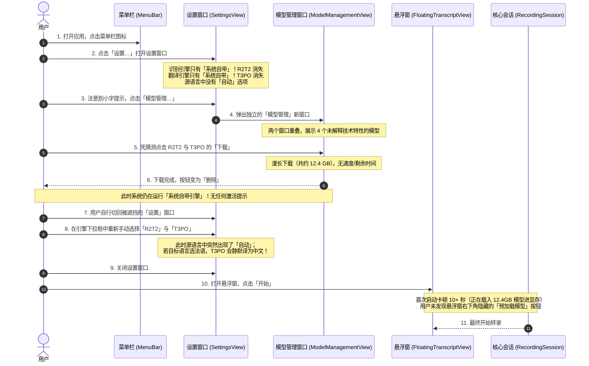
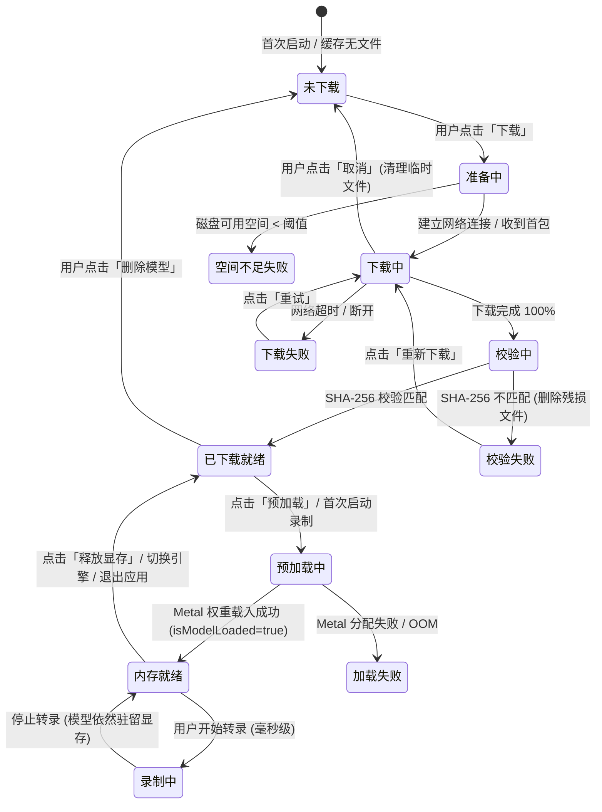

# OmniVoice 设置与模型管理交互优化方案 (UX Design Proposal)

> **文档定位**：交互与体验设计方案规范 (UX Specification)  
> **适用版本**：OmniVoice macOS 0.1.0+  
> **面向对象**：产品经理、前端/macOS 开发工程师、测试工程师  
> **状态**：Draft for Review  

---

## 目录

1. [背景与设计目标](#1-背景与设计目标)
2. [现状流程深度梳理 (As-Is User Journey)](#2-现状流程深度梳理-as-is-user-journey)
3. [现状痛点清单与代码/控件级映射 (Pain Points Breakdown)](#3-现状痛点清单与代码控件级映射-pain-points-breakdown)
4. [新交互方案设计 (To-Be UX Design)](#4-新交互方案设计-to-be-ux-design)
   - 4.1 [窗口拓扑与信息架构重构](#41-窗口拓扑与信息架构重构)
   - 4.2 [设置页（SettingsView）交互与控件设计](#42-设置页settingsview交互与控件设计)
   - 4.3 [模型管理页（ModelManagementView）体验升级](#43-模型管理页modelmanagementview体验升级)
   - 4.4 [语言选择联动与防呆规则 (Language Compatibility)](#44-语言选择联动与防呆规则-language-compatibility)
   - 4.5 [全生命周期状态机模型 (State Flow)](#45-全生命周期状态机模型-state-flow)
   - 4.6 [错误提示与异常恢复设计 (Error Handling & Recovery)](#46-错误提示与异常恢复设计-error-handling--recovery)
   - 4.7 [首次使用引导体验 (First-Run Onboarding)](#47-首次使用引导体验-first-run-onboarding)
5. [研发执行任务清单 (Implementation Work Breakdown Structure)](#5-研发执行任务清单-implementation-work-breakdown-structure)
6. [可选增强特性 (Optional Enhancements)](#6-可选增强特性-optional-enhancements)

---

## 1. 背景与设计目标

### 1.1 业务背景
OmniVoice 是一款专为 macOS 设计的菜单栏轻量级实时语音转录与双语字幕应用（`LSUIElement`，无 Dock 图标）。应用支持两类底层引擎的自由搭配：
1. **系统引擎（System Engine）**：基于 macOS 原生 `Speech.framework`（ASR）与 `Translation.framework`（翻译），无需下载权重，资源开销极小。
2. **本地模型引擎（In-process Model Engine）**：基于 `audio.cpp`（R2T2 语音识别）与 `llama.cpp`（T3PO / HY-MT1.5 神经翻译），完全离线运行、支持流式低延迟，但模型体积庞大（2.4 GB 至 10 GB 统一内存/显存）。

### 1.2 核心设计目标
- **消除心智断层**：解决“设置引擎”与“下载模型”在两个孤立窗口之间跳转、缺乏状态同步与自动激活的问题。
- **杜绝幽灵选项与盲区**：未下载的模型不应在设置列表中直接“蒸发”，让用户清楚看到支持哪些大模型，并可就地一键下载。
- **阻断静默错译与逻辑陷阱**：在源语言自动检测、目标语言模型兼容性（如 T3PO 目前仅支持中英日韩，其他语言会静默回退中文）上建立前置防御与高亮提醒。
- **将显存/预加载生命周期显性化**：把隐藏在悬浮窗角落的“预加载”能力带到设置中心，建立清晰的“未加载 / 载入中 / 内存就绪（占用显存）/ 释放”控制链路。
- **纯原生体验**：严格契合 macOS HIG 规范，不引入复杂重构，基于现有 `RecordingSession` 与 `ModelDownloadManager` 能力实现高内聚体验。

---

## 2. 现状流程深度梳理 (As-Is User Journey)

用户从**初次安装应用**到**成功使用本地大模型（R2T2 + T3PO）完成一次双语转录**，当前必须经历以下 11 个步骤：



---

## 3. 现状痛点清单与代码/控件级映射 (Pain Points Breakdown)

### 痛点 1：引擎配置与模型管理跨窗口割裂，下载后无激活闭环
- **对应源码**：
  - `Sources/OmniVoice/Views/SettingsView.swift`：L66-67 (`modelManagementButton`), L91, L192-197 (`openWindow(id: "modelManagement")`)
  - `Sources/OmniVoice/OmniVoiceApp.swift`：L31-40 (`Window("模型管理", id: "modelManagement")`), L42-45 (`Settings { SettingsView(...) }`)
- **交互缺陷**：
  - 用户在设置中配置引擎，却必须跳到另一个独立 Window 去下载。两个窗口层级平铺，容易互相遮挡。
  - 模型在 `ModelManagementView` 下载成功后，界面仅仅展示“已下载 · 约 XXX MB”，**完全没有“设为当前引擎”或“立即启用”的快捷引导**。用户常误以为下载即生效，退出后仍在使用系统自带框架。

### 痛点 2：引擎列表中的“幽灵选项”与可发现性破坏
- **对应源码**：
  - `Sources/OmniVoice/Views/SettingsView.swift`：L48-50, L83-85 (`ProviderCatalog.transcriptionEngines.filter { isEngineAvailable($0, ...) }`)
  - `Sources/OmniVoice/Views/SettingsView.swift`：L215-226 (`isEngineAvailable`), L282-289 (`noLocalModelHint`)
- **交互缺陷**：
  - 代码逻辑中，若本地未下载任何变体，Picker 的数据源会直接把 `model.r2t2`、`model.t3po`、`model.hymt15` **过滤删除**。
  - 用户点开“引擎”下拉框，看到的只有唯一的“系统自带 (Speech)”，产生严重错觉：“这个软件不是宣传支持本地大模型吗？怎么菜单里什么都没有？”
  - 仅在表单底部用一行低对比度的辅助文本 `Text("还没有可用的本地模型，点击上方「模型管理…」下载后即可选用")` 进行弱提示，极其容易被忽略。

### 痛点 3：模型库信息黑盒化，缺乏配对推荐与硬件指引
- **对应源码**：
  - `Sources/OmniVoice/Views/ModelManagementView.swift`：L73-127 (`variantRow`)
  - `Sources/OmniVoiceCore/Providers/ProviderCatalog.swift`：L84-128 (`modelVariants`)
- **交互缺陷**：
  - 界面只列出了极简名称和大小（如 `T3PO (Q5_K_M) 约 10021 MB`、`HY-MT1.5 1.8B (Q4_K_M) 约 1080 MB`）。
  - 用户无法得知：
    1. 什么是 R2T2？什么是 T3PO？它们分别负责什么环节？
    2. T3PO（10GB）与 HY-MT1.5（1GB）的核心区别是什么？（前者是流式 WAIT/TRANS 实时逐字预览；后者是一次性整句翻译，不支持实时预览）。
    3. 我的 Mac 是 8GB 内存还是 16GB/36GB 统一内存？我能否带得动 10GB 的 T3PO？
    4. “如果我想做实时会议字幕，我到底需要下哪几个？”缺乏一套标准的“组合套餐（Bundle）”推荐。

### 痛点 4：语言兼容性断层与致命的“静默错译陷阱”
- **对应源码**：
  - `Sources/OmniVoice/Views/LanguagePickers.swift`：L24-30 (`SourceLanguagePicker` 中的 `if transcriptionEngineKind == .model { Text("自动") }`)
  - `Sources/OmniVoiceCore/Inference/ModelLanguageMapping.swift`：L18-41 (`t3poTargetLanguage`), L43-58 (`hyMT15TargetLanguage`), L60-70 (`match(_:)`)
  - `Sources/OmniVoiceCore/Providers/LanguageCatalog.swift`：L18-21, L60-63 (`supportsSystemASRSource: false`)
- **交互缺陷**：
  - **盲区 A（“自动”去哪了）**：在系统 ASR 引擎下，“自动”选项直接在 UI 上被抹除。用户不知道“自动语种识别”是 R2T2 的专属特性，误以为应用缺少基础的多语言能力。
  - **盲区 B（静默回退中文，严重体验事故）**：`TargetLanguagePicker` 提供了 16 种常见语言（法、德、西、俄、越、泰等），但 `ModelLanguageMapping.swift` 内部硬编码：当使用本地模型（T3PO/HY-MT1.5）时，若目标语言不属于 `zh/yue/en/ja/ko`，**一律静默回退到 `.chinese`**！
    - 用户开会选“目标语言：法语”，说话后屏幕上出来的全都是中文，毫无任何错误提示，造成极大的困惑与对产品的信任危机。
  - **盲区 C（语言列表突变）**：从系统切换到 R2T2 时，俄、阿、越、泰会突然出现在源语言列表中，缺乏状态切换说明。

### 痛点 5：模型内存驻留（Preload）与显存释放缺乏可见性与触达路径
- **对应源码**：
  - `Sources/OmniVoice/FloatingPanel/FloatingTranscriptView.swift`：L338-392 (`modelStatusControl`, `preloadButton`)
  - `Sources/OmniVoice/Views/SettingsView.swift`：完全无预加载相关控制
  - `Sources/OmniVoice/Views/ModelManagementView.swift`：完全无预加载相关控制
  - `Sources/OmniVoiceCore/Session/RecordingSession.swift`：L41-53 (`isModelLoaded`), L621-702 (`preloadModel()`), L787-802 (`unloadModels()`)
- **交互缺陷**：
  - 本地模型从磁盘加载进统一内存需要 5~15 秒。
  - 目前全应用唯一的“预加载模型”和“释放模型”按钮，被放置在**悬浮窗底部的状态栏右下角**（L340-392）。
  - 若用户习惯从菜单栏直接启停录制并隐藏悬浮窗，首次启动录制会遭遇长达 15 秒的“假死”感。而在设置与模型管理两大核心后台页面中，用户竟然无法查看当前模型是否已经载入显存，也无法主动预热或释放高达 12GB 的显存占用。

### 痛点 6：下载中与异常状态反馈粗糙
- **对应源码**：
  - `Sources/OmniVoice/Views/ModelManagementView.swift`：L84-113 (`ProgressView`), L147-158 (`download`)
  - `Sources/OmniVoiceCore/Inference/ModelDownloadManager.swift`：L99-103 (`downloadProgress`), L298-302 (`insufficientDiskSpace`)
- **交互缺陷**：
  - 下载动辄 10 GB，界面仅有一个不断递增的百分比数字，**缺少瞬时下载速度（MB/s）、已下载量/总大小（GB/GB）、预计剩余时间（ETA）**。
  - 网络一旦断开，只会弹出一个原生的系统错误 Alert（`errorMessage = error.localizedDescription`），下载进度重置，没有内联重试按钮，也没有明确提示该资源来自 Hugging Face 及网络建议。
  - 磁盘空间不足时（`insufficientDiskSpace`），只有发生后才报错，未在用户点击下载前进行磁盘容量的前置直观可视化（例如：可用 15GB，需 10.5GB）。

### 痛点 7：参数间相互矛盾与无效设置干扰
- **对应源码**：
  - `Sources/OmniVoice/Views/SettingsView.swift`：L112-137
- **交互缺陷**：
  - 当翻译引擎选为“系统自带”时，设置界面展示了一个可以微调的步进器“长句提前翻译阈值：150 字”；但紧接着下方却显示一行灰色小字：“*系统自带识别引擎按句子结束才提交文本，此设置对该引擎无实际效果*”。
  - 既然无效果，就不应展示或应处于明确禁用状态。这种“允许调节却又提示无用”的逻辑让用户无所适从。

### 痛点 8：首次安装零引导（Blank Slate Problem）
- **对应源码**：
  - `Sources/OmniVoice/OmniVoiceApp.swift`：L10-46
- **交互缺陷**：
  - 首次启动应用，没有任何欢迎向导或初始化配置指引，直接弹出一个空白的悬浮窗并常驻菜单栏。用户不知从何着手，也不清楚本地大模型的优势与开启步骤。

---

## 4. 新交互方案设计 (To-Be UX Design)

### 4.1 窗口拓扑与信息架构重构

针对原先 `Settings` 与 `ModelManagement` 两个独立窗口互相割裂的问题，新方案采用**融合与多标签体系（Tabbed Preferences）**，同时保留菜单栏直达通道：

```
+---------------------------------------------------------------------------------+
|                                 OmniVoice 设置                                  |
+---------------------------------------------------------------------------------+
|  [ 🎙️ 语音与引擎 ]        [ 📦 模型库管理 ]        [ 🌐 语言与字幕 ]        [ ℹ️ 关于 ]  |
+---------------------------------------------------------------------------------+
|                                                                                 |
|  内容区：依据选中的 Tab 呈现结构化配置                                            |
|  - 标签 1 (语音与引擎)：引擎卡片选择、内联模型下载状态、显存预加载控制台            |
|  - 标签 2 (模型库管理)：全量模型卡片、推荐组合包一键下、下载监控、磁盘占用管理       |
|  - 标签 3 (语言与字幕)：默认源/目标语言、兼容性矩阵提示、悬浮窗透明度与排版          |
|  - 标签 4 (关于)：版本号、开源协议、使用指引、重置配置                             |
|                                                                                 |
+---------------------------------------------------------------------------------+
```

> **窗口路由规则**：
> - 用户点击菜单栏「设置…」或快捷键 `Cmd+,`：打开设置窗口，默认停留在上次访问的 Tab（或「语音与引擎」）。
> - 用户点击菜单栏「模型管理…」：打开设置窗口并**直接自动切换至「模型库管理」Tab**；若原独立窗口已有用户习惯，亦可在该 Tab 外保留独立轻量窗口形式，但其底层 UI 组件与模型卡片保持完全一致。

---

### 4.2 设置页（SettingsView）交互与控件设计

#### 4.2.1 引擎选择重构：彻底消除“幽灵引擎”
- **设计原则**：无论本地模型是否下载，引擎列表中**始终展示全部候选者**，并清晰标注状态标签。
- **UI 布局与形态**：采用**双态交互选择卡（Engine Selection Cards）**取代传统的裸露下拉菜单。

```
-----------------------------------------------------------------------------------
Section: 语音识别引擎 (ASR)
-----------------------------------------------------------------------------------
( ) 系统自带 (Speech)                       [系统原生 · 零内存占用]
    macOS 系统级语音识别，即开即用，无需额外下载。
    
(*) R2T2 离线大模型                          [已下载 · 就绪] / [未下载 · 约 2.4 GB]
    支持流式实时转录、标点预测与混合语种自动检测。
    
    [子级配置 - 仅在选中 R2T2 时展开]
    模型版本: [ R2T2 (Q8_0) - 高精度 2.4 GB  v ]
    本地状态: ● 已下载在缓存区 (占用 2.36 GB)        [重新校验]  [删除模型]
    
    [未下载时的内联操作]
    本地状态: ○ 尚未下载本地权重文件
    操作按钮: [ ⬇️ 一键下载并启用 R2T2 (2.4 GB) ]  (支持内联查看进度)
-----------------------------------------------------------------------------------

-----------------------------------------------------------------------------------
Section: 翻译引擎 (Translation)
-----------------------------------------------------------------------------------
( ) 系统自带 (Translation)                  [系统原生 · 整句翻译]
    macOS 内置翻译，按句子标点翻译，不支持实时打字机预览。

(*) T3PO 离线大模型                         [推荐 · 支持实时预览]
    高性能双语翻译大模型，支持打字机式逐字流式预览与自动纠错。
    
    [子级配置 - 仅在选中 T3PO 时展开]
    模型版本: [ T3PO (Q5_K_M) - 平衡版 9.8 GB  v ]
    翻译策略: [ 平衡模式 (默认推荐)  v ] 
             (文案辅助：平衡翻译准确率与实时输出速度)

( ) HY-MT1.5 1.8B 模型                      [轻量级 · 低内存]
    腾讯混元轻量翻译模型，内存开销小（仅 ~1.5 GB），整句翻译（无流式预览）。
-----------------------------------------------------------------------------------
```

#### 4.2.2 显存与预加载控制中心（Memory & Preload Console）
在引擎配置区底部，新增专门的**「引擎运行状态」控制台**，使用户在设置页即可直接掌控显存：

```
-----------------------------------------------------------------------------------
Section: 引擎运行与显存状态
-----------------------------------------------------------------------------------
[状态指示灯]  🟢 当前模型已加载至显存 (就绪)  /  ⚪ 空闲 (未载入显存)  /  🟡 正在加载中...
[资源占用]    预计占用统一内存：12.4 GB (R2T2: 2.4GB + T3PO: 10.0GB)
[说明信息]    已就绪状态下，首次点击录制可实现毫秒级即时响应。
[快捷操作]    [ ⚡ 预加载到显存 ]  /  [ 🧹 释放显存占用 ]
-----------------------------------------------------------------------------------
```

#### 4.2.3 动态参数可见性规则（Progressive Disclosure）
- **长句提前翻译阈值**：仅在选用支持单次整句翻译的引擎（如 `system.translation` 或 `model.hymt15`）**且** ASR 为可切片引擎时显示；若当前配置组合不支持该参数，直接隐藏该项，不再出现“此设置对该引擎无实际效果”的困惑提示。
- **翻译提交策略（Eagerness）**：仅在选中 `model.t3po` 时展示，提供“激进（低延迟）/ 平衡（推荐）/ 保守（高准确率）”三档。

---

### 4.3 模型管理页（ModelManagementView）体验升级

#### 4.3.1 引入“一键配置推荐组合”（One-Click Bundles）
在模型列表上方，设立预设方案推荐区，帮助初级与进阶用户快速决策：

```
+---------------------------------------------------------------------------------+
| 💡 推荐方案快速配置                                                             |
+---------------------------------------------------------------------------------+
| [ 方案 A：标准实时双语字幕 (推荐) ]                                               |
| 构成：R2T2 语音识别 (2.4 GB) + T3PO 实时流式翻译 (9.8 GB)                          |
| 特性：自动检测语种、逐字打字机流式显示、完全离线私密。建议 16GB+ 统一内存 Mac。       |
| 状态：已下载 1/2                                    [ ⬇️ 一键下载剩余组件 (9.8 GB) ] |
+---------------------------------------------------------------------------------+
| [ 方案 B：轻量低内存方案 ]                                                        |
| 构成：R2T2 语音识别 (2.4 GB) + HY-MT1.5 翻译 (1.1 GB)                             |
| 特性：占用内存极小 (~3.5 GB)，整句翻译输出。适合 8GB 内存设备。                     |
| 状态：未下载                                            [ ⬇️ 一键配置此方案 (3.5 GB) ] |
+---------------------------------------------------------------------------------+
```

#### 4.3.2 现代化模型卡片设计（Rich Model Card）
每个模型条目从原先单薄的一行扩展为信息充分的卡片：

```
+---------------------------------------------------------------------------------+
| [ 图标 ]  R2T2 语音识别大模型                                    [ 识别引擎 (ASR) ] |
| 版本：Confucius4-R2T2 (Q8_0 量化) · 文件大小：2.31 GB                              |
| 优势：针对中英文混合演讲、专业会议优化，支持多语种自动判别与断句标点补全。               |
| 存储路径：~/Library/Application Support/OmniVoice/Models/r2t2-q8_0.gguf          |
|                                                                                 |
| 状态展示：                                                                      |
| - [未下载]   磁盘空间充足 (可用 48.2 GB / 需 2.4 GB)       [ ⬇️ 下载模型 ]         |
| - [下载中]   [=======================>        ] 68%        [ ⏹️ 取消 ]             |
|              速度：18.5 MB/s | 已下载：1.6 GB / 2.31 GB | 剩余时间：约 42 秒       |
| - [已下载]   🟢 校验通过，就绪                           [ 设为当前引擎 ] [ 🗑️ 删除 ]|
+---------------------------------------------------------------------------------+
```

#### 4.3.3 下载完成后的闭环引导（Auto-Activation Prompt）
- 当用户在模型管理中成功下载某模型：
  1. 页面顶部滑出轻量通知横幅：  
     `🎉「T3PO 翻译模型」已下载完成！已自动将翻译引擎切换为 T3PO。 [ 撤销切换 ]`
  2. 若用户尚未下载配对的 ASR 引擎（如 R2T2），横幅下方附带联动提示：  
     `💡 搭配 R2T2 识别引擎可获得最佳实时打字机体验，[ 立即下载 R2T2 (2.4 GB) ]`

---

### 4.4 语言选择联动与防呆规则 (Language Compatibility)

语言选择器（`SourceLanguagePicker` 与 `TargetLanguagePicker`）必须与当前激活的引擎能力建立动态联动与防呆反馈：

#### 4.4.1 源语言“自动检测”的平滑引导
- **规则**：
  - 当使用 `model.r2t2` 时：首项为 `✨ 自动检测语种 (Auto)`，并默认选中。
  - 当使用 `system.speech` 时：首项**仍然保留**，但显示为 `✨ 自动检测 (仅 R2T2 本地模型支持)`，文本呈置灰状态（`.disabled(true)`）。
  - 若用户在系统引擎下试图点击该项，弹出内联 Popover 或提示文案：  
    `“macOS 系统自带识别引擎要求指定固定语种。如需自动识别混合语种，请在设置中切换为 R2T2 本地模型。”`

#### 4.4.2 目标语言与本地模型的防静默错译矩阵 (Anti-Fallback Guard)
针对 `ModelLanguageMapping.swift` 中非中英日韩语言静默回退中文的严重漏洞，采用**分组呈现 + 冲突警告**：

```
目标语言下拉列表结构：
┌───────────────────────────────────────────────┐
│ ★ 原生流式推荐 (T3PO 完美支持)                │
│   🇨🇳 简体中文                                  │
│   🇭🇰 粤语                                      │
│   🇹🇼 繁体中文                                  │
│   🇺🇸 英语                                      │
│   🇯🇵 日语                                      │
│   🇰🇷 韩语                                      │
├───────────────────────────────────────────────┤
│ ⚠️ 其他语言 (需系统翻译引擎支持)                │
│   🇫🇷 法语                                      │
│   🇩🇪 德语                                      │
│   🇪🇸 西班牙语                                  │
│   🇷🇺 俄语                                      │
│   ... (其余 10 种语言)                         │
└───────────────────────────────────────────────┘
```

- **交互防呆**：
  - 若用户当前翻译引擎为 `model.t3po` 或 `model.hymt15`，且强行选中了“法语”：
  - 界面立即在目标语言选择器下方渲染**黄色预警卡片**：
    > ⚠️ **语言支持提示**：当前选中的本地模型（T3PO）针对中、英、日、韩进行了专门训练。翻译至「法语」可能会回退为中文。  
    > **建议操作**：[ 一键将翻译引擎切换为「系统自带 (Translation)」 ]

---

### 4.5 全生命周期状态机模型 (State Flow)

为使工程团队能够严谨实现各状态转换，定义模型资产与引擎运行的完整状态机：



#### 关键状态与 UI 文案规范表

| 状态标识 | 状态说明 | 按钮文案 | 状态提示文案 | 允许操作 |
| :--- | :--- | :--- | :--- | :--- |
| `notDownloaded` | 未下载 | `下载` / `一键配置` | `约 X.X GB · 尚未下载` | 点击下载、查看详情 |
| `preparing` | 正在连接 | `取消` | `正在连接 Hugging Face...` | 取消 |
| `downloading` | 下载传输中 | `取消` | `下载中 45% · 18 MB/s · 剩余 1分20秒` | 取消下载 |
| `verifying` | 哈希校验中 | 禁用态 (Spinner) | `正在校验完整性 (SHA-256)...` | 无（防并发篡改） |
| `downloadFailed` | 下载异常 | `重试` | `网络异常中断 (点击重试)` | 重新发起下载 |
| `verifyFailed` | 损坏 | `重新下载` | `文件损坏或校验不匹配` | 清理并重下 |
| `downloaded` | 已就绪未载入 | `启用` / `预加载` | `已就绪 · 未载入显存 (占用 0 MB)` | 设为引擎、预加载、删除 |
| `preloading` | 载入内存中 | 禁用态 (Spinner) | `正在将模型载入 Metal 统一内存...` | 等待 |
| `memoryReady` | 常驻显存中 | `释放显存` | `🟢 已就绪 (占用 12.4 GB 统一内存)` | 释放显存、开始录制 |
| `recording` | 录制处理中 | `停止` (主界面) | `🔴 正在实时转录/翻译` | 禁用删除与切换 |

---

### 4.6 错误提示与异常恢复设计 (Error Handling & Recovery)

1. **磁盘空间不足拦截 (Pre-flight Disk Check)**：
   - 触发时机：在发起下载请求前，对比本地可用空间与 `variant.approximateSizeMB + 1024MB`。
   - 提示形态：非阻塞式警告 Modal 或内联提示。
   - 文案规范：
     - 标题：`磁盘空间不足`
     - 正文：`下载「T3PO 翻译模型」需要约 10.0 GB 空间（当前可用仅 4.2 GB）。请清理磁盘空间后重试。`
     - 操作：`[ 打开存储空间管理 ]`、`[ 知道了 ]`

2. **下载中断与断点指引 (Network Failure Recovery)**：
   - 触发时机：网络中断、DNS 解析失败或 HTTP 错误。
   - 提示形态：模型卡片内联显示错误条，不弹系统全局弹窗打扰用户。
   - 文案规范：
     - 文案：`下载中断：网络连接超时。模型托管于 Hugging Face，请检查您的网络连接或代理配置。`
     - 操作：`[ 立即重试 ]`、`[ 复制下载链接 ]` (允许用户在浏览器或下载器中使用第三方工具加速，配合本地导入)

3. **内存压力与显存不足告警 (Metal Out-Of-Memory Guard)**：
   - 触发时机：在 8GB 统一内存设备上加载 10GB T3PO 导致系统内存告急。
   - 提示形态：警告横幅。
   - 文案规范：
     - 文案：`系统可用统一内存较低，加载 T3PO 模型可能导致系统卡顿。建议选用更轻量的「HY-MT1.5 模型」(仅需 ~1.5 GB)。`
     - 操作：`[ 切换为轻量方案 ]`、`[ 仍要加载 ]`

---

### 4.7 首次使用引导体验 (First-Run Onboarding)

为解决新用户“安装后面对空白悬浮窗不知道怎么用”的痛点，新增轻量级**「3步启动向导 (Quick Setup Sheet)」**：

```
+---------------------------------------------------------------------------------+
|                                 欢迎使用 OmniVoice                              |
|                          macOS 离线实时双语字幕与转录工具                         |
+---------------------------------------------------------------------------------+
|                                                                                 |
|   Step 1: 基础系统授权                                                           |
|   [ 麦克风权限 ]   已授权 🟢                                                     |
|   [ 系统音频录制 ] 用于会议/网课声音捕获   [ 立即授权 ]                          |
|                                                                                 |
| ------------------------------------------------------------------------------- |
|                                                                                 |
|   Step 2: 选择适合您的运行模式                                                   |
|                                                                                 |
|   +------------------------------------+  +-----------------------------------+ |
|   | ( ) 极速轻量模式                   |  | (*) 高精离线大模型模式 (推荐)      | |
|   |     - 基于 macOS 自带引擎          |  |     - 基于 R2T2 + T3PO 离线大模型 | |
|   |     - 零磁盘占用，即开即用         |  |     - 混合语种自动判别，打字机流式 | |
|   |     - 适合轻度记录与快速尝鲜       |  |     - 需下载约 12.4 GB 模型       | |
|   +------------------------------------+  +-----------------------------------+ |
|                                                                                 |
| ------------------------------------------------------------------------------- |
|                                                                                 |
|   [  跳过向导  ]                                         [  一键开启并下载  ]    |
|                                                                                 |
+---------------------------------------------------------------------------------+
```

- **交互逻辑**：
  - 点击“极速轻量模式”：直接关闭向导，引擎设为系统自带，悬浮窗提示“已就绪，点击开始即可转录”。
  - 点击“高精离线大模型模式”：后台自动将 R2T2 与 T3PO 加入下载队列，菜单栏显示下载进度条，转入正常主界面，并给予提示：“模型正在后台下载中，下载完成后将自动为您无缝启用”。

---

## 5. 研发执行任务清单 (Implementation Work Breakdown Structure)

为方便开发团队按步骤进行敏捷迭代，将方案拆分为 4 个递进里程碑、共 15 条明确任务：

### 里程碑 1：防呆与严重可用性问题修复 (P0 · Quick Wins)
- [ ] **Task 1.1 (语言防静默错译)**：在 `LanguagePickers.swift` 中为 `TargetLanguagePicker` 增加引擎支持检测。当选中 T3PO/HY-MT1.5 且目标语言为非中英日韩时，展示黄色预警卡片与一键切换系统翻译引擎按钮。
- [ ] **Task 1.2 (源语言自动检测显性化)**：在 `SourceLanguagePicker` 中，在系统 ASR 模式下不要直接移除“自动”选项，而是将其显示为置灰态并带提示后缀“（需本地 R2T2 引擎）”，点击弹出解释。
- [ ] **Task 1.3 (引擎列表展示全部候选)**：修改 `SettingsView.swift` 中的 `isEngineAvailable` 逻辑，在 Picker 中始终呈现所有引擎，未下载引擎追加“（未下载 · 点击配置）”并跳转对应操作，避免引擎凭空消失。
- [ ] **Task 1.4 (清理无效参数干扰)**：优化 `SettingsView.swift` 中“长句提前翻译阈值”的展示条件，当识别引擎为系统 ASR 时直接隐藏或明确置灰该 Stepper。

### 里程碑 2：模型管理信息丰富化与下载闭环 (P1 · Core UX)
- [ ] **Task 2.1 (下载后自动激活与反馈)**：在 `ModelManagementView.swift` 中，当某个引擎的模型下载完成后，检测当前对应引擎是否仍为系统引擎；若是，自动切换并弹出带“撤销”选项的成功横幅。
- [ ] **Task 2.2 (模型卡片说明与规格扩展)**：在 `ProviderCatalog.swift` 的 `ModelVariant` 与 `EngineDescriptor` 中补充面向用户的展示字段（功能定位、推荐配置、显存需求等），并在 `ModelManagementView` 中渲染出富文本卡片。
- [ ] **Task 2.3 (推荐组合包一键下载)**：在 `ModelManagementView` 顶部新增“标准实时双语方案 (R2T2+T3PO)”与“轻量方案 (R2T2+HY-MT1.5)”两个预设卡片，支持一键批量触发下载。
- [ ] **Task 2.4 (下载进度指标完善)**：扩展 `ModelDownloadManager.swift`，基于时间窗口计算并发布瞬时下载速度（MB/s）与预估剩余时间（ETA），更新在进度条下方。

### 里程碑 3：设置与模型管理深度融合 (P1 · Architecture Integration)
- [ ] **Task 3.1 (SettingsView 多标签体系)**：重构 `SettingsView.swift` 结构，引入 `TabView`（语音与引擎 / 模型库 / 语言与悬浮窗 / 关于），扩大窗口尺寸至 560×480。
- [ ] **Task 3.2 (内联模型下载与状态卡片)**：在“语音与引擎”Tab 中，选中未下载的模型引擎时，直接在卡片下方呈现内联下载按钮与实时进度，无需强制切走窗口。
- [ ] **Task 3.3 (显存预加载控制台移入设置页)**：将目前仅存在于悬浮窗底部的“预加载模型”与“释放显存”功能（`session.preloadModel()` / `session.unloadModels()`）引入设置页，展示实时内存驻留状态灯与操作按钮。
- [ ] **Task 3.4 (菜单栏直达与 Tab 联动)**：调整 `OmniVoiceApp.swift` 与 `MenuBarContentView.swift`，点击“模型管理…”时直达设置窗口的对应 Tab，保持操作连贯。

### 里程碑 4：首次引导与防灾保障 (P2 · Onboarding & Robustness)
- [ ] **Task 4.1 (首次启动向导 Quick Setup Sheet)**：实现应用初次启动时的 3 步向导卡片（权限校验 -> 模式选择：轻量系统 vs 高精离线 -> 启动），结果持久化记录到 `UserDefaults`。
- [ ] **Task 4.2 (下载前磁盘空间可视化预检)**：在用户点击下载前，直观检查并显示目标磁盘可用空间，空间不足时拦截并给出引导。
- [ ] **Task 4.3 (异常状态内联重试)**：将网络中断与校验错误收敛到模型卡片内部的“重试”按钮，提供更友好的错误说明文本。

---

## 6. 可选增强特性 (Optional Enhancements)

以下特性属于体验拔高项，不影响现有主体流程，标注为“可选增强”，建议后续版本评估引入：

1. **[可选增强] 本地已有 GGUF 权重一键导入 (Custom Model Path Import)**
   - *背景*：许多开发者或高级用户本地已通过 `curl` 或 Ollama 下载过 `r2t2-q8_0.gguf` 或 `Confucius4-T3PO-Q5_K_M.gguf`。
   - *设计*：在模型卡片中增加“导入本地已有文件…”操作，用户选择本地文件后，系统校验 SHA-256 并软链接或复制到 App Support 缓存目录，免去重复下载 10GB 流量。

2. **[可选增强] Hugging Face 国内镜像源切换 (Download Mirror Acceleration)**
   - *背景*：国内用户直连 Hugging Face 下载大文件可能遭遇速度慢或中断。
   - *设计*：在设置/模型管理底部提供可选的“下载镜像节点”（如 `hf-mirror.com`），提升大模型首次拉取的成功率与体验。

3. **[可选增强] 菜单栏图标悬停浮窗状态概览 (Hover Popover on Menu Bar)**
   - *背景*：菜单栏小图标在下载时显示百分比，用户想看具体是哪个模型在下。
   - *设计*：鼠标悬停在菜单栏图标时，展示迷你 Popover：列出正在下载的模型名称、速度及预估完成时间。

---

## 7. 方案验收标准 (Acceptance Criteria)

1. **认知可用性**：一个从未使用过 OmniVoice 的用户，能够在一目了然的情况下清楚知道应用支持哪些本地模型，并在 1 次点击内完成推荐模型的拉取。
2. **下载与启用闭环**：下载完成后，引擎选择应无缝对接，不再出现“下载了却未启用”的无响应尴尬。
3. **零静默故障**：任何不兼容的语言组合（如 T3PO + 法语）均有显著的前置告警或自动拦截，不可出现静默译为中文的异常现象。
4. **显存透明可控**：用户在设置页能直接看懂“模型是否在显存中”，并能随时一键释放显存以避免与其他大型生产力软件冲突。
5. **代码契约遵从**：所有交互设计严格基于现有的 `RecordingSession`、`ProviderCatalog` 与 `ModelDownloadManager` 接口，无多余后端依赖，开发工期可控。
